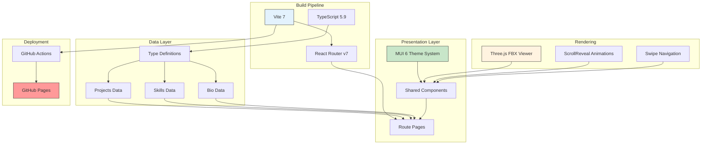
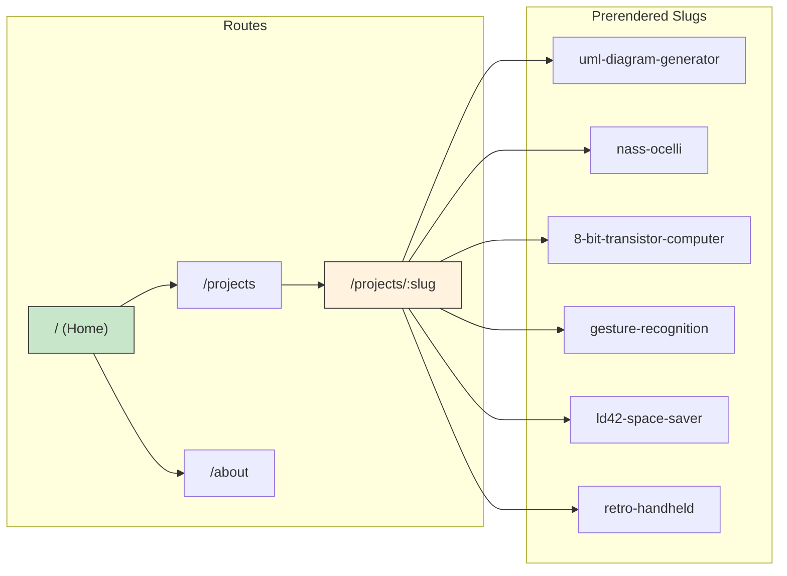
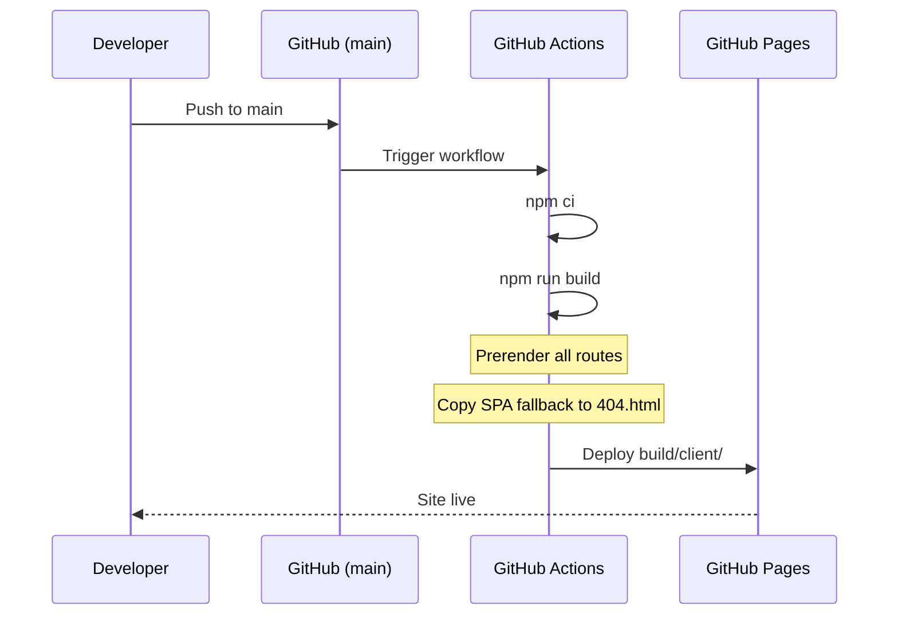

# Site Architecture

**Document Type**: Architecture
**Status**: Complete
**Date**: 2026-02-26
**Audience**: Developers
**Tags**: #architecture #overview #react

---

## Overview

The portfolio site is a statically prerendered single-page application built on React 19, React Router v7, and Material UI 6. It replaces a legacy vanilla HTML/CSS/JS site while preserving its distinctive visual identity — dark monochromatic theme, wireframe 3D model rendering, and animated navigation.

All content is defined in static TypeScript data files. There is no database or backend. The site is deployed as static HTML to GitHub Pages.

---

## System Architecture

---

## Layer Breakdown

### Build Pipeline

The build pipeline transforms TypeScript source into prerendered static HTML.

| Component | Role | Key Detail |
|-----------|------|------------|
| **Vite 7** | Bundler and dev server | Handles HMR, chunk splitting, asset optimization |
| **React Router v7** | Routing and prerendering | SPA mode with static HTML generation for all routes |
| **TypeScript 5.9** | Type safety | Strict mode, path aliases via `~/` |

### Presentation Layer

The presentation layer follows MUI's theme system for consistent styling.

| Component | Role | Key Detail |
|-----------|------|------------|
| **MUI Theme** | Design tokens | Dark palette, Inter + Fira Code typography, component overrides |
| **Route Pages** | Page-level views | Home, Projects, Project Detail, About |
| **Shared Components** | Reusable UI | Navbar, Footer, ScrollReveal, ProjectCard, SkillCard |

### Data Layer

Content is defined as typed static objects — no runtime fetching.

| File | Content | Consumed By |
|------|---------|-------------|
| **projects.ts** | 6 projects with model configs, tags, links | Home, Projects, Project Detail |
| **skills.ts** | 6 skill categories with proficiency data | About |
| **bio.ts** | Name, title, bio paragraphs, social links | About |
| **types.ts** | All shared TypeScript interfaces | All data files and components |

### Rendering

Specialized rendering systems handle visual features.

| System | Purpose | Behavior |
|--------|---------|----------|
| **FBX Model Viewer** | 3D wireframe model display | Auto-spin, hover-to-reset, mouse-follow on detail pages |
| **ScrollReveal** | Entrance animations | Fade + slide-up on scroll into view, respects reduced motion |
| **Swipe Navigation** | Nav link hover effect | Left-to-right fill with mix-blend-mode inversion |

---

## Routing Architecture

All routes are prerendered at build time. A `404.html` SPA fallback handles direct URL access on GitHub Pages.

---

## Deployment Flow

---

## Key Design Decisions

- **Static data over database** — Content changes infrequently. Static TS files are simpler, free, and have zero runtime dependencies.
- **Three.js in own chunk** — The 3D library (~550KB) is split via Vite `manualChunks` so pages without models don't load it.
- **MUI over custom CSS** — Matches the ChefshatSite reference stack. Provides consistent theming, responsive breakpoints, and accessible components out of the box.
- **Prerendering over SSR** — `ssr: false` with prerendered HTML. No server needed — pure static hosting on GitHub Pages.
- **Dark theme with white primary** — Preserves the monochromatic identity of the legacy site while moving to a polished modern aesthetic.
