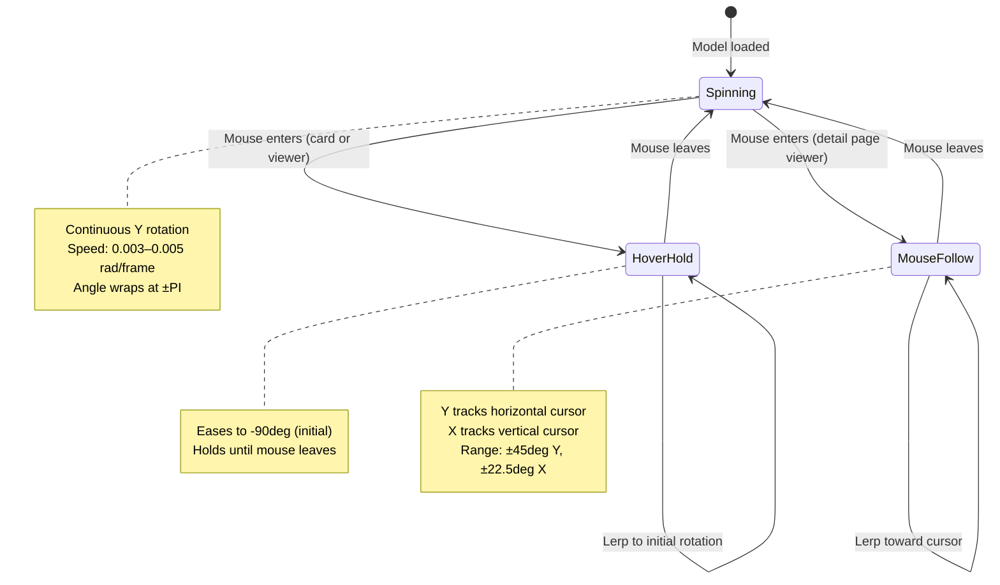
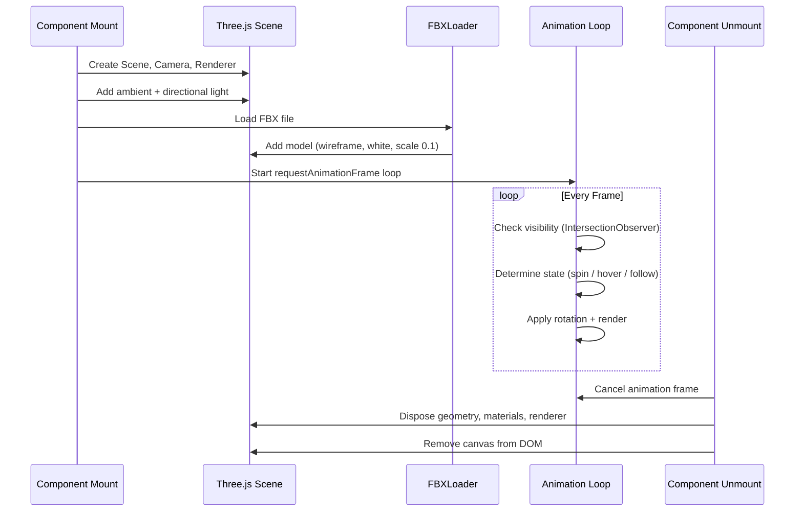

# 3D Model System

**Document Type**: Specification
**Status**: Complete
**Date**: 2026-02-26
**Related Spec**: [[architecture/site-architecture|Site Architecture]]
**Audience**: Developers
**Tags**: #three-js #3d #rendering

---

## Overview

The 3D Model System renders interactive wireframe FBX models for each project. Models auto-spin, respond to hover by returning to their initial orientation, and on project detail pages, follow the mouse cursor. The system is built on Three.js and manages its own lifecycle — including scene setup, animation loops, and full cleanup on navigation.

---

## Model Behavior States

---

## Model Configuration

Each project defines a model configuration that controls camera positioning and scale.

| Field | Type | Description |
|-------|------|-------------|
| **path** | string | URL to FBX file in `/public/models/` |
| **cameraZ** | number | Camera distance from model on Z axis |
| **cameraY** | number | Camera vertical offset |
| **scale** | number (optional) | Override default scale of 0.1 |

### Per-Project Configurations

| Project | FBX File | Camera Z | Camera Y |
|---------|----------|----------|----------|
| UML Diagram Generator | uml_generator.fbx | 60 | 0 |
| [NASS] Ocelli | Ocelli.fbx | 60 | -6 |
| 8-bit Transistor Computer | Transistor.fbx | 80 | -30 |
| Gesture Recognition | Gesture.fbx | 10 | 0 |
| [LD42] Space Saver | SpaceDef.fbx | 26 | 0 |
| Retro Handheld | Handheld.fbx | 100 | -10 |

---

## Rendering Pipeline

---

## Interaction Modes

### Auto-Spin (Default)

- Model rotates on Y axis at configurable speed
- Initial rotation is **-90 degrees** (`-PI/2`) so the model's "front" faces the viewer
- Spin angle wraps at `±PI` to prevent floating point accumulation over long sessions

### Hover Hold (Cards + Home)

- Triggered by `hovered` prop from parent card **or** direct mouseenter on the viewer
- Model lerps back to initial rotation (`-PI/2`) at a rate of 0.08 per frame
- Uses shortest-path normalization to avoid spinning the long way around
- On mouse leave, spin resumes smoothly from the current angle

### Mouse Follow (Detail Pages)

- Enabled via `followMouse` prop
- Mouse position normalized to `-1..1` relative to viewer container center
- Y rotation: `INITIAL_ROTATION + mouseX * 45deg`
- X rotation: `-mouseY * 22.5deg`
- Both axes lerped at 0.08 per frame for smooth tracking
- On mouse leave, model eases back to initial rotation then resumes spinning

---

## Performance Considerations

| Concern | Mitigation |
|---------|------------|
| **Bundle size** (~550KB) | Three.js split into own chunk via Vite `manualChunks` |
| **Off-screen rendering** | IntersectionObserver pauses animation when model is not visible |
| **Memory leaks** | Full cleanup on unmount: geometry, materials, renderer disposed; canvas removed |
| **Pixel density** | `devicePixelRatio` capped at 2 to avoid excessive GPU load on HiDPI |
| **Resize handling** | ResizeObserver on container (not window) for responsive layout changes |
