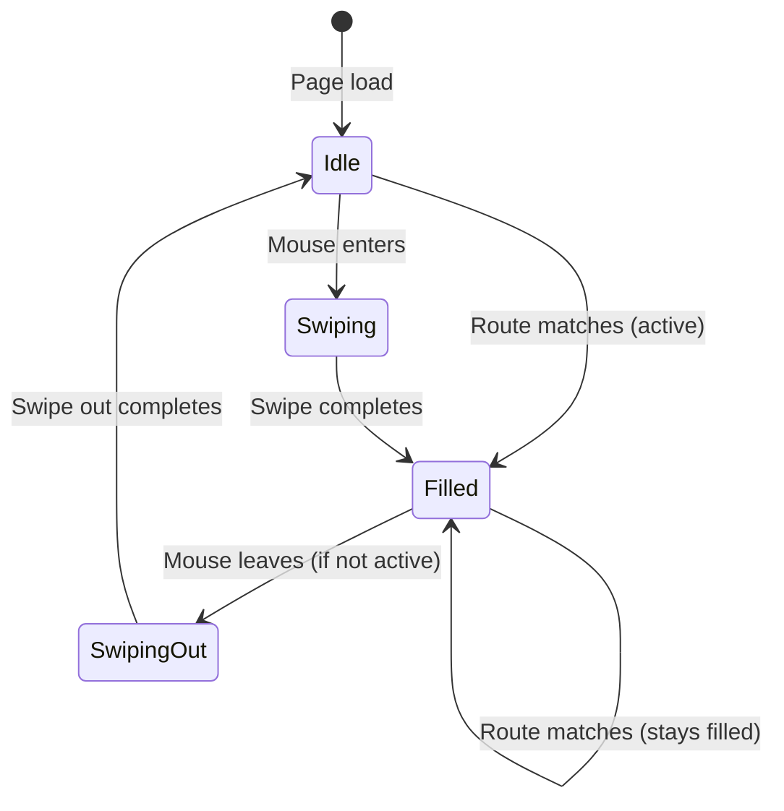
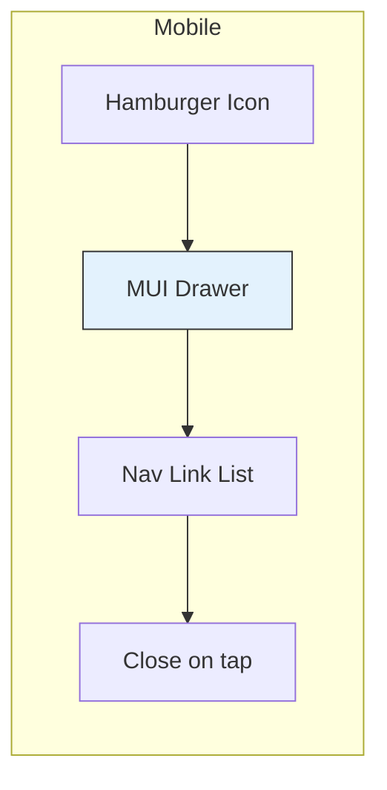

# Navigation System

**Document Type**: Specification
**Status**: Complete
**Date**: 2026-02-26
**Related Spec**: [[architecture/site-architecture|Site Architecture]]
**Audience**: Developers
**Tags**: #navigation #animation #ui

---

## Overview

The navigation system provides route-based navigation with a distinctive swipe-fill hover effect on desktop and a drawer menu on mobile. It evolved from the legacy site's grid-of-squares animation into a cleaner swipe approach that preserves the `mix-blend-mode: difference` text inversion.

---

## Desktop Navigation

### Swipe Fill Effect

Each nav link contains an absolutely-positioned white fill element behind the text.

| State | Fill Transform | Text Appearance |
|-------|---------------|-----------------|
| **Idle** | `translateX(-100%)` — fully off-screen left | Light gray (`text.secondary`) |
| **Hovered** | `translateX(0)` — slides in from left | Inverted via `mix-blend-mode: difference` |
| **Active route** | `translateX(0)` — permanently filled | Inverted, white on black |
| **Leaving (non-active)** | `translateX(-100%)` — slides back out | Returns to light gray |

**Transition**: `transform 0.25s ease-out`

---

## Mobile Navigation

- Breakpoint: `md` (MUI default: 900px)
- Drawer anchored to the right
- Background matches `background.default`
- Nav links in Fira Code monospace
- Drawer closes on link tap

---

## Navigation Items

| Label | Route | Active When |
|-------|-------|-------------|
| **Home** | `/` | Exact match on `/` |
| **Projects** | `/projects` | Path starts with `/projects` |
| **About** | `/about` | Path starts with `/about` |

Active state is determined by `useLocation().pathname`, not scroll position (unlike the legacy single-page site).

---

## Header Bar

| Property | Value |
|----------|-------|
| **Position** | Sticky |
| **Background** | `rgba(10, 10, 10, 0.85)` with `backdrop-filter: blur(12px)` |
| **Border** | 1px bottom, divider color |
| **Max width** | 1200px centered |
| **Brand** | "LEFINNO KWOK" in Fira Code, weight 600 |
