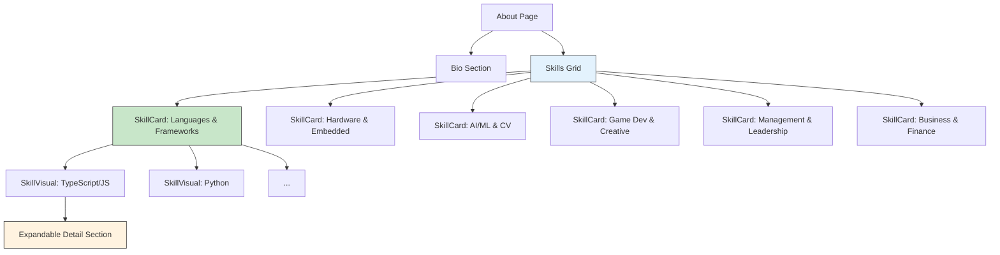
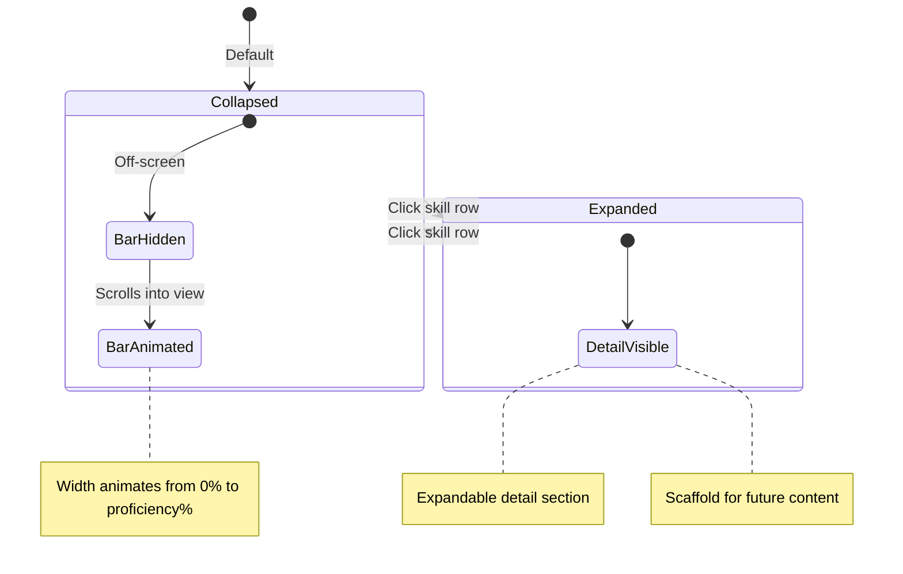

# Skills System

**Document Type**: Specification
**Status**: Complete
**Date**: 2026-02-26
**Related Spec**: [[architecture/site-architecture|Site Architecture]]
**Audience**: Developers
**Tags**: #skills #about #ui

---

## Overview

The Skills System displays the developer's competencies organized into six categories. Each category is always visible as an expanded card. Individual skills within each card show animated proficiency bars and are independently expandable for future detailed content.

---

## Component Hierarchy

---

## Skill Categories

| Category | Icon | Skills Count | Description |
|----------|------|-------------|-------------|
| **Languages & Frameworks** | Code | 6 | Core programming languages and web frameworks |
| **Hardware & Embedded** | Memory | 5 | PCB design, microcontrollers, IoT |
| **AI/ML & Computer Vision** | Psychology | 4 | OpenCV, MediaPipe, NLP, LLMs |
| **Game Dev & Creative** | SportsEsports | 5 | Unity, 3D modeling, music, Three.js |
| **Management & Leadership** | Groups | 4 | Project management, agile, mentorship |
| **Business & Finance** | Business | 3 | Strategy, finance, entrepreneurship |

---

## Grid Layout

| Breakpoint | Columns |
|------------|---------|
| **xs** (0–600px) | 1 |
| **sm** (600–900px) | 2 |
| **md** (900px+) | 3 |

Gap: 24px (MUI spacing 3)

---

## SkillCard Behavior

Each card is **always expanded** — no collapse/expand at the category level.

**Visible content:**
- Category icon + label (header)
- Category description
- All skills listed with proficiency bars

---

## SkillVisual Behavior

Each individual skill row is the expandable element.

### Proficiency Bar

| Element | Style |
|---------|-------|
| **Track** | 4px height, `rgba(255,255,255,0.08)` background |
| **Fill** | Animated width (0% → proficiency%), rounded |
| **Fill color** | `text.primary` when ≥ 80%, `text.secondary` otherwise |
| **Animation** | `width 0.8s ease-out`, triggered by IntersectionObserver |
| **Label** | Skill name (left) + percentage (right) |

### Expand Chevron

- Small expand-more icon on the right of each skill row
- Rotates 180deg when expanded
- Click opens a `Collapse` section below with detail content
- Currently shows placeholder — scaffold for future interactive demos per skill

---

## Data Model

### SkillGroup

| Field | Type | Description |
|-------|------|-------------|
| **id** | SkillCategory | Unique identifier |
| **label** | string | Display name |
| **description** | string | Brief category summary |
| **icon** | string | MUI icon name |
| **skills** | Skill[] | Array of skills in this category |

### Skill

| Field | Type | Description |
|-------|------|-------------|
| **name** | string | Display name |
| **proficiency** | number (0–100) | Visual bar fill percentage |
| **hasDemo** | boolean | Whether an interactive demo exists |
| **demoComponentName** | string (optional) | Lazy-load component name for future demos |
