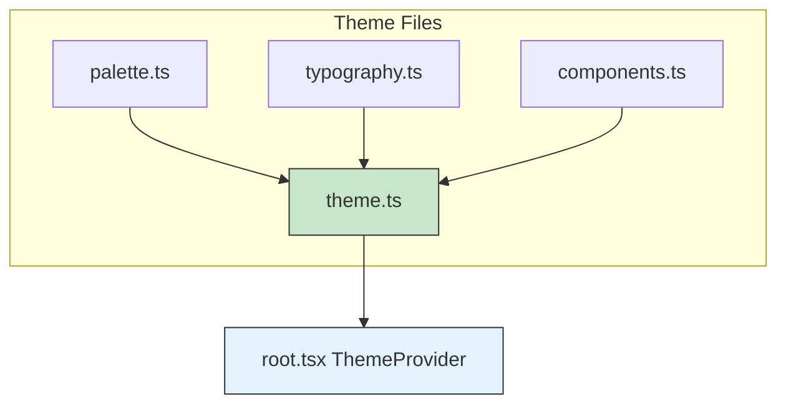
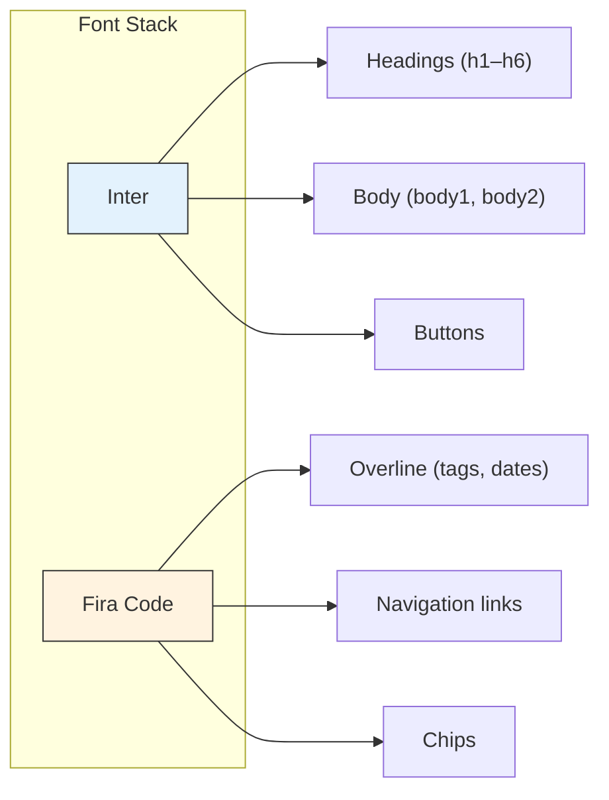

# Theme System

**Document Type**: Specification
**Status**: Complete
**Date**: 2026-02-26
**Related Spec**: [[architecture/site-architecture|Site Architecture]]
**Audience**: Developers, Designers
**Tags**: #theme #design #mui

---

## Overview

The theme system defines the visual language of the portfolio. It is built on MUI's `createTheme` and decomposed into four files — palette, typography, component overrides, and assembly. The design direction is **dark modern**: near-black backgrounds, white primary color, clean sans-serif typography with monospace accents.

---

## Theme Composition

---

## Color Palette

| Token | Value | Usage |
|-------|-------|-------|
| **mode** | `dark` | MUI dark mode baseline |
| **primary.main** | `#ffffff` | Buttons, active states, emphasis |
| **primary.contrastText** | `#0a0a0a` | Text on primary surfaces |
| **secondary.main** | `#6e6e6e` | Muted actions, inactive elements |
| **background.default** | `#0a0a0a` | Page background |
| **background.paper** | `#141414` | Cards, elevated surfaces |
| **text.primary** | `#f0f0f0` | Body text, headings |
| **text.secondary** | `#a0a0a0` | Descriptions, labels, dates |
| **divider** | `#2a2a2a` | Borders, separators |

**Key Principle:** The palette is monochromatic. White is the only accent. Depth comes from surface elevation (`#0a0a0a` → `#141414`) rather than color variation.

---

## Typography

| Variant | Font | Weight | Notes |
|---------|------|--------|-------|
| **h1** | Inter | 800 | Letter-spacing: -0.02em |
| **h2** | Inter | 700 | Letter-spacing: -0.01em |
| **h3–h6** | Inter | 600–700 | Standard |
| **body1, body2** | Inter | 400 | Default reading text |
| **button** | Inter | 600 | No text-transform |
| **overline** | Fira Code | 400 | Letter-spacing: 0.05em. Used for dates, tags, labels |

**Key Principle:** Inter is the primary typeface for readability. Fira Code is reserved for developer-identity accents — it signals "technical" without making the whole site feel like a terminal.

---

## Component Overrides

| Component | Override | Effect |
|-----------|----------|--------|
| **MuiButton** | 8px radius, 1px white border (20% opacity) | Subtle outlined look. Scale 1.02 + border brightens on hover |
| **MuiCard** | 12px radius, 1px white border (8% opacity) | Barely visible border. TranslateY -4px + border brightens on hover |
| **MuiAppBar** | No background image, no elevation | Flat transparent bar with backdrop blur |
| **MuiChip** | 6px radius, Fira Code font, 0.75rem | Compact technical labels |
| **MuiPaper** | 12px radius, no background image | Clean surface with consistent rounding |
| **MuiButton, MuiIconButton** | Ripple disabled | Cleaner interaction feel for dark theme |

---

## Accessibility

- **Focus indicators**: 2px white outline on `:focus-visible`, removed on mouse click
- **Reduced motion**: Global CSS forces `animation-duration: 0.01ms`, `transition-duration: 0.01ms`, and `scroll-behavior: auto` when `prefers-reduced-motion: reduce` is active
- **Smooth scroll**: Enabled only when motion preference allows
